==============
Datasets panel
==============
Dataset panel is the central place to manage your datasets. Datasets are available to all sessions of a user. A user could choose to share dataset with other users.

Upload
======
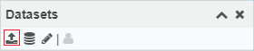

This is the initial state of dataset panel.
You could use this upload button to upload dataset. See :doc:`/getting-started` for more detail.

|
|

Dataset actions
===============

Visualize dataset
-----------------
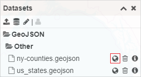

Click the globe button after the dataset name to add the dataset to layer panel and visualize the dataset.

Once the dataset is visualized. The globe button will be replaced by a remove button. Click this button to remove the dataset from visualization.

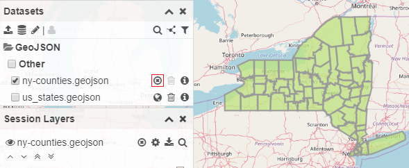

|

Delete dataset
--------------
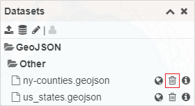

Click the trash can button after dataset name to delete one dataset. A confirmation prompt will be shown before deleting the dataset. Dataset deletion is irreversible.

|

Dataset info
------------
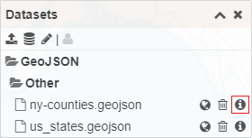

Click this button will show a popup window displaying dataset related metadata

|
|

Dataset selection actions
=========================
There are features available only when there are datasets in selected states. To select a dataset or group of datasets, hovering cursor before a dataset or group name, then check the checkbox.

.. image:: img/datasets_panel_selection-single.png

Dataset selection action will appear at the top right corner of the panel. Some are only available when one dataset is selected. Some are available when multiple datasets are selected.

|

Visualize datasets boundaries
-----------------------------
.. image:: img/datasets_panel-selection-boundary_button.png

This action will visualize boundary bounding box of one or more selected datasets. 

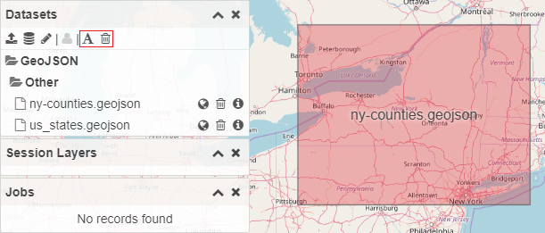

When boundaries are being visualized, two additional actions will be available to toggle the label of boundaries or remove all boundaries.

|

Filter dataset list boundary
----------------------------
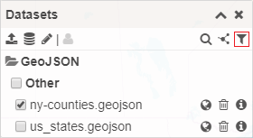

When there is one dataset selected, click on this action will filter the list of datasets available and only show datasets that overlap the boundary of selected dataset. 

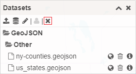

When the list of datasets being filtered a remove action will be available to stop the filtering.

|

Visualize or delete multiple datasets
-------------------------------------
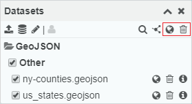

When more than one dataset has been selected, a globe and trash can icon will appear on the top right as selection action. They will visualize or delete all selected datasets.

|

Share datasets
--------------
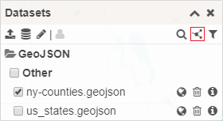

This action will make selected datasets available to other users to read. Shared dataset won't be editable by other users. The dataset icon will change to indicate the dataset is being shared.

|
|

Toggle shared dataset visibility
================================
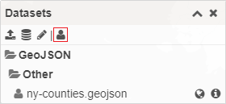

The person icon is a toggle action to show or hide datasets shared by other users. The person icon in front of dataset name indicates this dataset is being shared with the user.
