===============
Getting Started
===============

GeoJSON
=======

Loading
-------

A GeoJSON can be loaded to Minerva the same way a GeoTIFF is loaded.
Upload the GeoJSON using the uploader widget. This step will add a
new entry in the datasets panel.

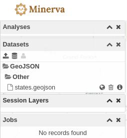

With the globe button, the layer can be added to the map.

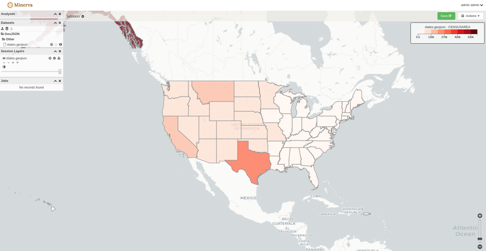

Similar to the GeoTIFF, clicking on a feature on the map will return the
attributes for the clicked feature.

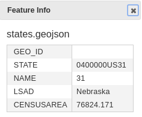

Styling
-------

When a GeoJSON dataset is uploaded, a default style will be assigned to it.
In order to change that click on the cog button.

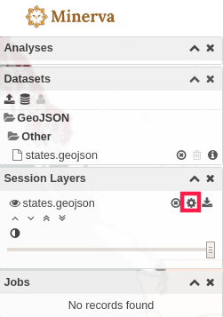

This will open up the modal for styling the layers. Here points, lines or
polygons can be styled. A color table can be created based on a given attribute,
opacity values can be assigned and values can be rescaled in a linear, logarithmic
or quantile fashion. Values can also be clamped between a minimum and maximum
value. These options make it possible to visualize the datasets in lot of different ways.

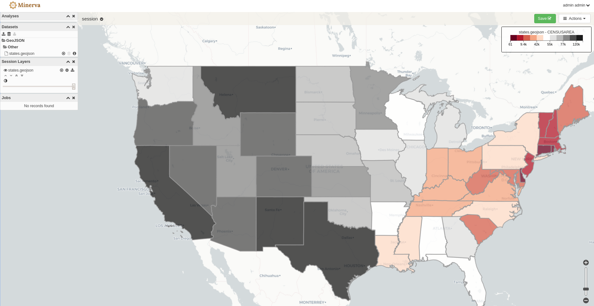

GeoTIFF
=======

Loading
-------

The first step to visualize a GeoTIFF with Minerva is to load it.
In order to do that click on the upload button in the dataset panel.

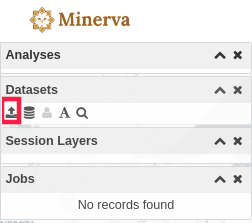

After uploading the Geotiff, it would appear in the Datasets panel.

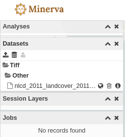

To visualize the layer simply click on the globe button.

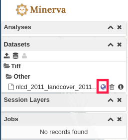

This step would add the layer on the map.

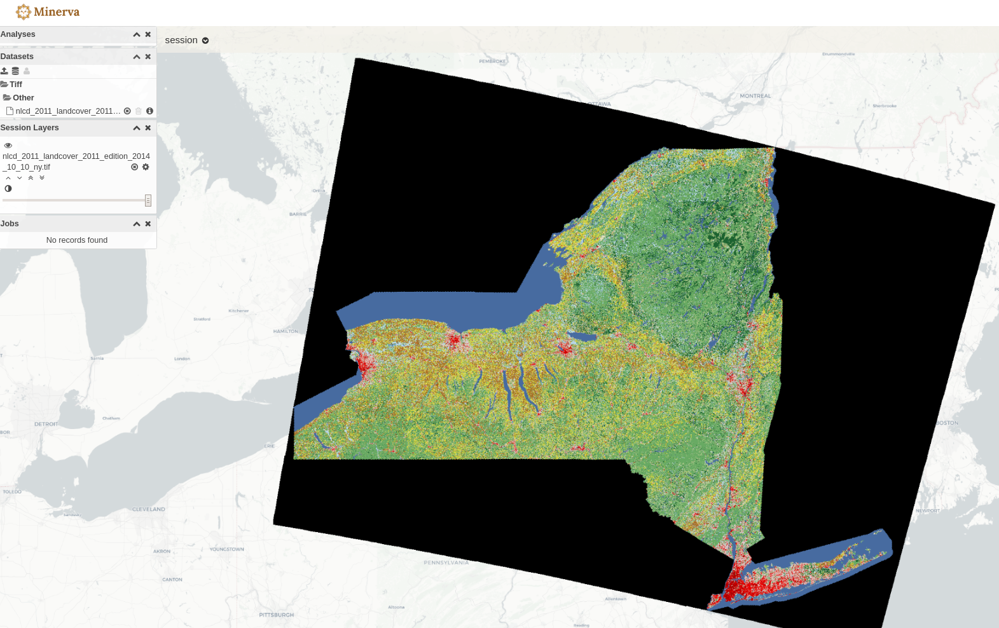

In order to query a location in the layer, simply click on the layer.
There will be a pop up to show the value for a given layer.

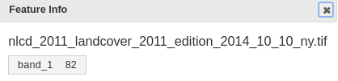

Styling
-------

If the Geotiff already has styling information embedded, it will
be picked it up and will become the default visualization for the layer.
If not a default styling will be assigned to the layer.

In order to change the styling of the raster layer click on the cog button.

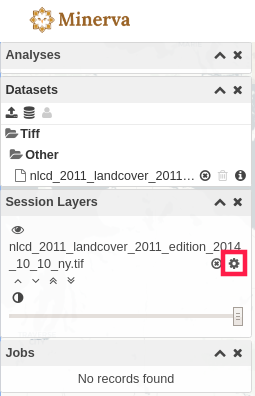

This button will pop up the styling dialog which can be used to change the
default styling of the layer.

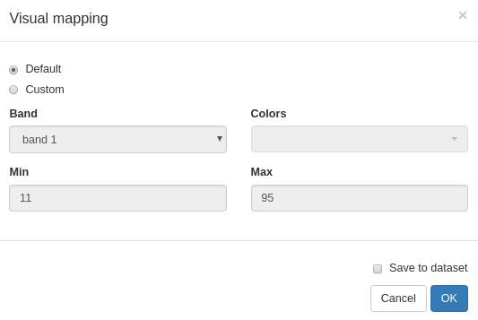

In this panel select the "Custom" radio button and then select a band.
A stretch between different minimum and maximum values can be also specified.
If "Save to Dataset" checkbox is checked than the styling options will be
persisted. If that option is not applied, a page refresh will wipe out the
selected styling.

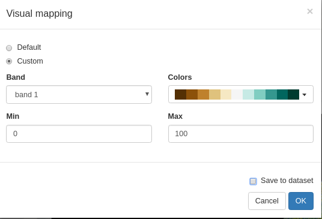

After clicking on "OK" the new styling would be applied.

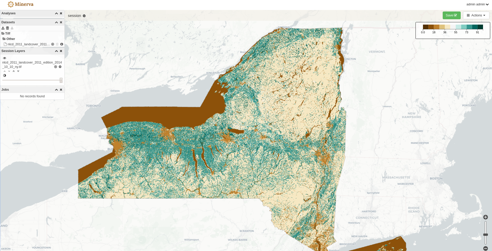
